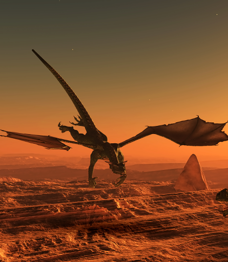

# BigBridge

BigBridge é uma plataforma interativa de RPG online que permite a jogadores criarem sprites personalizados e batalharem em arenas virtuais — tudo diretamente do navegador.

## 🌐 Visão Geral

Este projeto inclui três principais páginas:

- **Home (`index.html`)**: Apresentação do projeto, chamada para jogar e links de navegação.
- **Game (`fighter.html`)**: Interface do jogo principal, com embed do jogo disponível em `https://rpg.bigbridge.com.br/`.
- **Sprite Maker (`team.html`)**: Criador de personagens com embed para `https://spritemaker.bigbridge.com.br`.

## 🖼️ Imagens destacadas

### Logo


### Destaques do Jogo
  


### Galeria de Lutadores




## 🚀 Começando

Clone o projeto:

```bash
git clone https://github.com/IrvingSamuel/bigbridge.git
cd bigbridge
